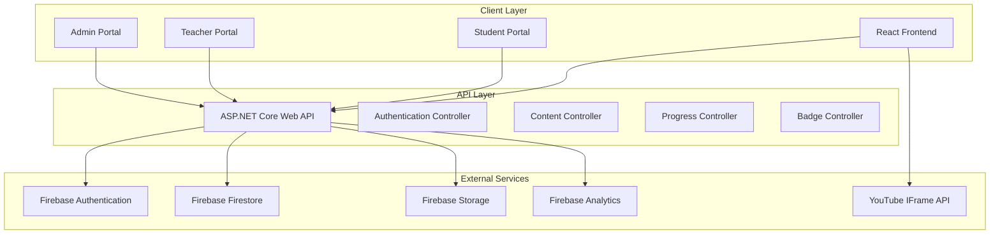
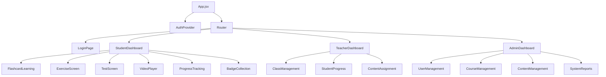

# Design Document - BingGo English Learning Web Application

## Overview

This design document outlines the technical architecture and implementation approach for converting the BingGo English Learning Android application to a modern web application. The system will maintain all existing functionality while leveraging web technologies to provide cross-platform accessibility and enhanced user experience.

## Architecture

### System Architecture Diagram



### Technology Stack

| Layer | Technology | Purpose | Justification |
|-------|------------|---------|---------------|
| **Frontend** | React 18 + JavaScript | User Interface | Component-based architecture, excellent for interactive learning interfaces |
| **Backend** | ASP.NET Core 8 Web API | Business Logic | High performance, excellent Firebase integration, strong typing |
| **Database** | Firebase Firestore | Data Storage | NoSQL flexibility, real-time updates, existing data compatibility |
| **Authentication** | Firebase Auth | User Management | Secure, scalable, integrates with existing user base |
| **File Storage** | Firebase Storage | Media Files | Optimized for images/videos, CDN capabilities |
| **Analytics** | Firebase Analytics | Usage Tracking | Learning behavior insights, performance monitoring |
| **Video** | YouTube IFrame API | Video Lessons | Existing video content, reliable streaming |
| **Styling** | CSS3 + Styled Components | UI Styling | Component-scoped styles, responsive design |

## Components and Interfaces

### Frontend Component Architecture



### Key React Components

#### 1. FlashcardLearning Component
```javascript
const FlashcardLearning = () => {
  const [currentCard, setCurrentCard] = useState(0);
  const [isFlipped, setIsFlipped] = useState(false);
  const [learnedCards, setLearnedCards] = useState(new Set());
  const [flashcards, setFlashcards] = useState([]);
  
  // Animation states and handlers
  const [flipAnimation, setFlipAnimation] = useState('');
  
  const flipCard = () => {
    setFlipAnimation('flip-start');
    setTimeout(() => {
      setIsFlipped(!isFlipped);
      setFlipAnimation('flip-end');
    }, 150);
  };
  
  const markAsLearned = (learned) => {
    const newLearnedCards = new Set(learnedCards);
    if (learned) {
      newLearnedCards.add(currentCard);
    } else {
      newLearnedCards.delete(currentCard);
    }
    setLearnedCards(newLearnedCards);
    updateProgress(newLearnedCards.size, flashcards.length);
  };
  
  return (
    <div className="flashcard-container">
      <div className={`flashcard ${flipAnimation} ${isFlipped ? 'flipped' : ''}`}>
        <div className="flashcard-front">
          {flashcards[currentCard]?.frontText}
          {flashcards[currentCard]?.imageUrl && (
            
          )}
        </div>
        <div className="flashcard-back">
          {flashcards[currentCard]?.backText}
          {flashcards[currentCard]?.exampleSentence && (
            <p className="example">{flashcards[currentCard].exampleSentence}</p>
          )}
        </div>
      </div>
      {/* Navigation and learning controls */}
    </div>
  );
};
```

#### 2. ExerciseScreen Component
```javascript
const ExerciseScreen = ({ exerciseId, onComplete }) => {
  const [questions, setQuestions] = useState([]);
  const [currentQuestion, setCurrentQuestion] = useState(0);
  const [answers, setAnswers] = useState([]);
  const [timeLeft, setTimeLeft] = useState(null);
  const [exerciseType, setExerciseType] = useState('');
  
  useEffect(() => {
    // Timer logic for timed exercises
    if (timeLeft > 0) {
      const timer = setTimeout(() => setTimeLeft(timeLeft - 1), 1000);
      return () => clearTimeout(timer);
    } else if (timeLeft === 0) {
      handleSubmit();
    }
  }, [timeLeft]);
  
  const handleAnswer = (answer) => {
    const newAnswers = [...answers, answer];
    setAnswers(newAnswers);
    
    if (currentQuestion < questions.length - 1) {
      setCurrentQuestion(currentQuestion + 1);
    } else {
      handleSubmit(newAnswers);
    }
  };
  
  const handleSubmit = (finalAnswers = answers) => {
    const score = calculateScore(finalAnswers, questions);
    updateLearningHistory(exerciseId, score);
    checkBadgeEligibility('exercise_complete');
    onComplete(score);
  };
  
  const renderQuestion = () => {
    const question = questions[currentQuestion];
    
    if (exerciseType === 'multiple_choice') {
      return (
        <MultipleChoiceQuestion
          question={question}
          onAnswer={handleAnswer}
        />
      );
    } else if (exerciseType === 'fill_blank') {
      return (
        <FillBlankQuestion
          question={question}
          onAnswer={handleAnswer}
        />
      );
    }
  };
  
  return (
    <div className="exercise-screen">
      {timeLeft && (
        <div className="timer">
          Time Left: {Math.floor(timeLeft / 60)}:{(timeLeft % 60).toString().padStart(2, '0')}
        </div>
      )}
      <div className="progress-bar">
        <div 
          className="progress-fill" 
          style={{ width: `${((currentQuestion + 1) / questions.length) * 100}%` }}
        />
      </div>
      {renderQuestion()}
    </div>
  );
};
```

#### 3. BadgeSystem Component
```javascript
const BadgeSystem = ({ userId }) => {
  const [badges, setBadges] = useState([]);
  const [unseenBadges, setUnseenBadges] = useState([]);
  
  useEffect(() => {
    loadUserBadges();
    checkForNewBadges();
  }, [userId]);
  
  const badgeDefinitions = [
    {
      id: 'badge1',
      name: 'Chăm chỉ đăng nhập',
      description: 'Đăng nhập 3 ngày liên tiếp',
      imageUrl: 'https://i.postimg.cc/Gm7BStxm/Depth-5-Frame-0.png',
      condition: 'login_streak_3'
    },
    {
      id: 'badge2',
      name: 'Chuyên gia Flashcard',
      description: 'Học xong 1 bộ flashcard',
      imageUrl: 'https://i.postimg.cc/VNqxkrZY/Depth-6-Frame-0.png',
      condition: 'flashcard_complete'
    },
    // ... other badges
  ];
  
  const checkBadgeCondition = async (condition, userId) => {
    switch (condition) {
      case 'login_streak_3':
        return await checkLoginStreak(userId, 3);
      case 'flashcard_complete':
        return await checkFlashcardCompletion(userId);
      case 'exercise_complete':
        return await checkExerciseCompletion(userId);
      // ... other conditions
    }
  };
  
  const awardBadge = async (badgeId) => {
    await updateDoc(doc(db, 'users', userId), {
      [`badges.${badgeId}.earned`]: true,
      [`badges.${badgeId}.earnedAt`]: new Date()
    });
    
    // Show badge notification
    setUnseenBadges(prev => [...prev, badgeId]);
  };
  
  return (
    <div className="badge-system">
      <div className="badge-grid">
        {badges.map(badge => (
          <div key={badge.id} className={`badge-card ${badge.earned ? 'earned' : 'locked'}`}>
            
            <h3>{badge.name}</h3>
            <p>{badge.description}</p>
          </div>
        ))}
      </div>
      
      {/* Badge notification modals */}
      {unseenBadges.map(badgeId => (
        <BadgeNotification
          key={badgeId}
          badge={badgeDefinitions.find(b => b.id === badgeId)}
          onClose={() => setUnseenBadges(prev => prev.filter(id => id !== badgeId))}
        />
      ))}
    </div>
  );
};
```

### Backend API Architecture

#### ASP.NET Core Controllers

```csharp
[ApiController]
[Route("api/[controller]")]
public class FlashcardController : ControllerBase
{
    private readonly IFirebaseService _firebaseService;
    private readonly IBadgeService _badgeService;
    
    public FlashcardController(IFirebaseService firebaseService, IBadgeService badgeService)
    {
        _firebaseService = firebaseService;
        _badgeService = badgeService;
    }
    
    [HttpGet("sets/{courseId}")]
    public async Task<IActionResult> GetFlashcardSets(string courseId)
    {
        var sets = await _firebaseService.GetFlashcardSetsByCourse(courseId);
        return Ok(sets);
    }
    
    [HttpGet("set/{setId}/cards")]
    public async Task<IActionResult> GetFlashcards(string setId)
    {
        var cards = await _firebaseService.GetFlashcardsBySet(setId);
        return Ok(cards);
    }
    
    [HttpPost("progress")]
    public async Task<IActionResult> UpdateProgress([FromBody] FlashcardProgressDto progress)
    {
        await _firebaseService.UpdateFlashcardProgress(progress);
        
        // Check for badge eligibility
        if (progress.CompletionPercentage >= 100)
        {
            await _badgeService.CheckAndAwardBadge(progress.UserId, "flashcard_complete");
        }
        
        return Ok();
    }
}

[ApiController]
[Route("api/[controller]")]
public class ExerciseController : ControllerBase
{
    [HttpGet("{courseId}")]
    public async Task<IActionResult> GetExercises(string courseId)
    {
        var exercises = await _firebaseService.GetExercisesByCourse(courseId);
        return Ok(exercises);
    }
    
    [HttpPost("submit")]
    public async Task<IActionResult> SubmitExercise([FromBody] ExerciseSubmissionDto submission)
    {
        var result = await _firebaseService.ProcessExerciseSubmission(submission);
        
        // Update learning history
        await _firebaseService.UpdateLearningHistory(submission.UserId, new LearningActivity
        {
            Type = "exercise",
            ExerciseId = submission.ExerciseId,
            Score = result.Score,
            CompletedAt = DateTime.UtcNow
        });
        
        // Check badges
        await _badgeService.CheckAndAwardBadge(submission.UserId, "exercise_complete");
        
        return Ok(result);
    }
}
```

## Data Models

### Firebase Firestore Collections Structure

```typescript
// Users Collection
interface User {
  id: string;
  full_name: string;
  email: string;
  role: 'student' | 'teacher' | 'admin' | 'parent';
  gender: string;
  avatar_url?: string;
  avatar_base64?: string;
  streak_count: number;
  last_login_date: string;
  class_ids?: string[];
  badges: Record<string, {
    earned: boolean;
    earnedAt?: Date;
  }>;
}

// Courses Collection
interface Course {
  id: string;
  name: string;
  description: string;
  image_url: string;
  created_at: FirebaseTimestamp;
  target_age_group: string;
}

// Classes Collection
interface Class {
  id: string;
  name: string;
  description: string;
  capacity: number;
  course_id: string;
  teacher_id: string;
  student_ids: string[];
  created_at: string;
  is_active: boolean;
}

// Flashcard Sets Collection
interface FlashcardSet {
  id: string;
  title: string;
  description: string;
  course_id: string;
  created_by: string;
  created_at: FirebaseTimestamp;
  assigned_class_ids: string[];
  set_id: string;
}

// Flashcards Collection
interface Flashcard {
  id: string;
  flashcard_set_id: string;
  front_text: string;
  back_text: string;
  example_sentence?: string;
  image_url?: string;
  image_base64?: string;
  order: number;
}

// Exercises Collection
interface Exercise {
  id: string;
  title: string;
  type: 'multiple_choice' | 'fill_blank';
  course_id: string;
  questions: Question[];
  time_limit?: number;
  difficulty: 'easy' | 'medium' | 'hard';
}

// Questions Collection
interface Question {
  id: string;
  content: string;
  type: 'multiple_choice' | 'fill_blank';
  options?: string[];
  correct_answer: string | number;
  explanation?: string;
  difficulty: 'easy' | 'medium' | 'hard';
  course_id: string;
  tags: string[];
  created_by: string;
  created_at: number;
  is_active: boolean;
}

// Progress Tracking
interface LearningProgress {
  user_id: string;
  course_id: string;
  flashcard_sets_completed: string[];
  exercises_completed: string[];
  tests_completed: string[];
  videos_watched: string[];
  total_study_time: number;
  last_activity: Date;
  streak_data: {
    current_streak: number;
    longest_streak: number;
    last_activity_date: string;
  };
}
```

## Error Handling

### Frontend Error Handling Strategy

```javascript
// Global Error Boundary
class ErrorBoundary extends React.Component {
  constructor(props) {
    super(props);
    this.state = { hasError: false, error: null };
  }
  
  static getDerivedStateFromError(error) {
    return { hasError: true, error };
  }
  
  componentDidCatch(error, errorInfo) {
    console.error('Application Error:', error, errorInfo);
    // Log to Firebase Analytics
    logEvent(analytics, 'app_error', {
      error_message: error.message,
      error_stack: error.stack
    });
  }
  
  render() {
    if (this.state.hasError) {
      return (
        <div className="error-fallback">
          <h2>Oops! Something went wrong</h2>
          <p>We're sorry for the inconvenience. Please try refreshing the page.</p>
          <button onClick={() => window.location.reload()}>
            Refresh Page
          </button>
        </div>
      );
    }
    
    return this.props.children;
  }
}

// API Error Handling
const apiCall = async (endpoint, options = {}) => {
  try {
    const response = await fetch(`${API_BASE_URL}${endpoint}`, {
      ...options,
      headers: {
        'Content-Type': 'application/json',
        'Authorization': `Bearer ${await getAuthToken()}`,
        ...options.headers
      }
    });
    
    if (!response.ok) {
      throw new Error(`API Error: ${response.status} ${response.statusText}`);
    }
    
    return await response.json();
  } catch (error) {
    console.error('API Call Failed:', error);
    
    // Show user-friendly error messages
    if (error.message.includes('401')) {
      // Redirect to login
      window.location.href = '/login';
    } else if (error.message.includes('403')) {
      showNotification('You do not have permission to perform this action', 'error');
    } else if (error.message.includes('500')) {
      showNotification('Server error. Please try again later.', 'error');
    } else {
      showNotification('Network error. Please check your connection.', 'error');
    }
    
    throw error;
  }
};
```

### Backend Error Handling

```csharp
// Global Exception Middleware
public class GlobalExceptionMiddleware
{
    private readonly RequestDelegate _next;
    private readonly ILogger<GlobalExceptionMiddleware> _logger;
    
    public GlobalExceptionMiddleware(RequestDelegate next, ILogger<GlobalExceptionMiddleware> logger)
    {
        _next = next;
        _logger = logger;
    }
    
    public async Task InvokeAsync(HttpContext context)
    {
        try
        {
            await _next(context);
        }
        catch (Exception ex)
        {
            _logger.LogError(ex, "An unhandled exception occurred");
            await HandleExceptionAsync(context, ex);
        }
    }
    
    private static async Task HandleExceptionAsync(HttpContext context, Exception exception)
    {
        context.Response.ContentType = "application/json";
        
        var response = new
        {
            message = "An error occurred while processing your request",
            details = exception.Message
        };
        
        switch (exception)
        {
            case UnauthorizedAccessException:
                context.Response.StatusCode = 401;
                response = new { message = "Unauthorized access" };
                break;
            case ArgumentException:
                context.Response.StatusCode = 400;
                response = new { message = "Invalid request parameters" };
                break;
            case KeyNotFoundException:
                context.Response.StatusCode = 404;
                response = new { message = "Resource not found" };
                break;
            default:
                context.Response.StatusCode = 500;
                break;
        }
        
        await context.Response.WriteAsync(JsonSerializer.Serialize(response));
    }
}
```

## Testing Strategy

### Frontend Testing Approach

```javascript
// Component Testing with React Testing Library
import { render, screen, fireEvent, waitFor } from '@testing-library/react';
import { FlashcardLearning } from '../components/FlashcardLearning';

describe('FlashcardLearning Component', () => {
  const mockFlashcards = [
    {
      id: '1',
      front_text: 'Hello',
      back_text: 'Xin chào',
      example_sentence: 'Hello, how are you?'
    }
  ];
  
  test('should flip card when clicked', async () => {
    render(<FlashcardLearning flashcards={mockFlashcards} />);
    
    const flashcard = screen.getByTestId('flashcard');
    expect(flashcard).toHaveTextContent('Hello');
    
    fireEvent.click(flashcard);
    
    await waitFor(() => {
      expect(flashcard).toHaveClass('flipped');
      expect(flashcard).toHaveTextContent('Xin chào');
    });
  });
  
  test('should update progress when card is marked as learned', async () => {
    const mockUpdateProgress = jest.fn();
    render(
      <FlashcardLearning 
        flashcards={mockFlashcards} 
        onProgressUpdate={mockUpdateProgress}
      />
    );
    
    const learnedButton = screen.getByText('Learned');
    fireEvent.click(learnedButton);
    
    expect(mockUpdateProgress).toHaveBeenCalledWith({
      learned: 1,
      total: 1,
      percentage: 100
    });
  });
});

// Integration Testing
describe('Exercise Flow Integration', () => {
  test('should complete full exercise workflow', async () => {
    // Mock API responses
    jest.spyOn(global, 'fetch').mockImplementation((url) => {
      if (url.includes('/exercises/')) {
        return Promise.resolve({
          ok: true,
          json: () => Promise.resolve(mockExerciseData)
        });
      }
      if (url.includes('/submit')) {
        return Promise.resolve({
          ok: true,
          json: () => Promise.resolve({ score: 80, passed: true })
        });
      }
    });
    
    render(<ExerciseScreen exerciseId="test-exercise" />);
    
    // Answer all questions
    for (let i = 0; i < mockExerciseData.questions.length; i++) {
      const option = screen.getByText(mockExerciseData.questions[i].options[0]);
      fireEvent.click(option);
    }
    
    // Verify submission
    await waitFor(() => {
      expect(screen.getByText('Score: 80%')).toBeInTheDocument();
    });
  });
});
```

### Backend Testing Strategy

```csharp
// Unit Testing with xUnit
public class FlashcardControllerTests
{
    private readonly Mock<IFirebaseService> _mockFirebaseService;
    private readonly Mock<IBadgeService> _mockBadgeService;
    private readonly FlashcardController _controller;
    
    public FlashcardControllerTests()
    {
        _mockFirebaseService = new Mock<IFirebaseService>();
        _mockBadgeService = new Mock<IBadgeService>();
        _controller = new FlashcardController(_mockFirebaseService.Object, _mockBadgeService.Object);
    }
    
    [Fact]
    public async Task GetFlashcardSets_ReturnsOkResult_WithFlashcardSets()
    {
        // Arrange
        var courseId = "test-course";
        var expectedSets = new List<FlashcardSet>
        {
            new FlashcardSet { Id = "set1", Title = "Colors", CourseId = courseId }
        };
        
        _mockFirebaseService
            .Setup(s => s.GetFlashcardSetsByCourse(courseId))
            .ReturnsAsync(expectedSets);
        
        // Act
        var result = await _controller.GetFlashcardSets(courseId);
        
        // Assert
        var okResult = Assert.IsType<OkObjectResult>(result);
        var returnedSets = Assert.IsType<List<FlashcardSet>>(okResult.Value);
        Assert.Single(returnedSets);
        Assert.Equal("Colors", returnedSets[0].Title);
    }
    
    [Fact]
    public async Task UpdateProgress_AwardsBadge_WhenFlashcardSetCompleted()
    {
        // Arrange
        var progress = new FlashcardProgressDto
        {
            UserId = "user1",
            SetId = "set1",
            CompletionPercentage = 100
        };
        
        // Act
        await _controller.UpdateProgress(progress);
        
        // Assert
        _mockBadgeService.Verify(
            s => s.CheckAndAwardBadge("user1", "flashcard_complete"),
            Times.Once
        );
    }
}

// Integration Testing
public class ApiIntegrationTests : IClassFixture<WebApplicationFactory<Program>>
{
    private readonly WebApplicationFactory<Program> _factory;
    private readonly HttpClient _client;
    
    public ApiIntegrationTests(WebApplicationFactory<Program> factory)
    {
        _factory = factory;
        _client = _factory.CreateClient();
    }
    
    [Fact]
    public async Task GetFlashcardSets_ReturnsSuccessStatusCode()
    {
        // Arrange
        var courseId = "LABTsID1zvPRsVjPjhLd";
        
        // Act
        var response = await _client.GetAsync($"/api/flashcard/sets/{courseId}");
        
        // Assert
        response.EnsureSuccessStatusCode();
        var content = await response.Content.ReadAsStringAsync();
        Assert.NotEmpty(content);
    }
}
```

## Performance Optimization

### Frontend Performance Strategies

```javascript
// Code Splitting and Lazy Loading
const StudentDashboard = lazy(() => import('./pages/StudentDashboard'));
const TeacherDashboard = lazy(() => import('./pages/TeacherDashboard'));
const AdminDashboard = lazy(() => import('./pages/AdminDashboard'));

function App() {
  return (
    <Router>
      <Suspense fallback={<LoadingSpinner />}>
        <Routes>
          <Route path="/student" element={<StudentDashboard />} />
          <Route path="/teacher" element={<TeacherDashboard />} />
          <Route path="/admin" element={<AdminDashboard />} />
        </Routes>
      </Suspense>
    </Router>
  );
}

// Image Optimization
const OptimizedImage = ({ src, alt, ...props }) => {
  const [imageSrc, setImageSrc] = useState(null);
  const [isLoading, setIsLoading] = useState(true);
  
  useEffect(() => {
    const img = new Image();
    img.onload = () => {
      setImageSrc(src);
      setIsLoading(false);
    };
    img.src = src;
  }, [src]);
  
  return (
    <div className="image-container">
      {isLoading && <div className="image-placeholder">Loading...</div>}
      {imageSrc && (
        
      )}
    </div>
  );
};

// Memoization for Expensive Components
const FlashcardGrid = memo(({ flashcards, onCardSelect }) => {
  return (
    <div className="flashcard-grid">
      {flashcards.map(card => (
        <FlashcardCard
          key={card.id}
          card={card}
          onClick={() => onCardSelect(card)}
        />
      ))}
    </div>
  );
});

// Virtual Scrolling for Large Lists
const VirtualizedQuestionList = ({ questions }) => {
  const [visibleRange, setVisibleRange] = useState({ start: 0, end: 20 });
  const containerRef = useRef();
  
  const handleScroll = useCallback(() => {
    const container = containerRef.current;
    const scrollTop = container.scrollTop;
    const itemHeight = 60;
    const containerHeight = container.clientHeight;
    
    const start = Math.floor(scrollTop / itemHeight);
    const end = Math.min(
      start + Math.ceil(containerHeight / itemHeight) + 5,
      questions.length
    );
    
    setVisibleRange({ start, end });
  }, [questions.length]);
  
  return (
    <div
      ref={containerRef}
      className="virtualized-list"
      onScroll={handleScroll}
      style={{ height: '400px', overflowY: 'auto' }}
    >
      <div style={{ height: questions.length * 60 }}>
        {questions.slice(visibleRange.start, visibleRange.end).map((question, index) => (
          <QuestionItem
            key={question.id}
            question={question}
            style={{
              position: 'absolute',
              top: (visibleRange.start + index) * 60,
              height: 60
            }}
          />
        ))}
      </div>
    </div>
  );
};
```

### Backend Performance Optimization

```csharp
// Caching Strategy
public class CachedFirebaseService : IFirebaseService
{
    private readonly IFirebaseService _firebaseService;
    private readonly IMemoryCache _cache;
    private readonly TimeSpan _cacheExpiry = TimeSpan.FromMinutes(15);
    
    public CachedFirebaseService(IFirebaseService firebaseService, IMemoryCache cache)
    {
        _firebaseService = firebaseService;
        _cache = cache;
    }
    
    public async Task<List<Course>> GetCoursesAsync()
    {
        const string cacheKey = "courses_all";
        
        if (_cache.TryGetValue(cacheKey, out List<Course> cachedCourses))
        {
            return cachedCourses;
        }
        
        var courses = await _firebaseService.GetCoursesAsync();
        _cache.Set(cacheKey, courses, _cacheExpiry);
        
        return courses;
    }
    
    public async Task<List<FlashcardSet>> GetFlashcardSetsByCourse(string courseId)
    {
        var cacheKey = $"flashcard_sets_{courseId}";
        
        if (_cache.TryGetValue(cacheKey, out List<FlashcardSet> cachedSets))
        {
            return cachedSets;
        }
        
        var sets = await _firebaseService.GetFlashcardSetsByCourse(courseId);
        _cache.Set(cacheKey, sets, _cacheExpiry);
        
        return sets;
    }
}

// Batch Operations for Firebase
public async Task<List<Question>> GetQuestionsByIds(List<string> questionIds)
{
    const int batchSize = 10; // Firestore limit
    var questions = new List<Question>();
    
    for (int i = 0; i < questionIds.Count; i += batchSize)
    {
        var batch = questionIds.Skip(i).Take(batchSize);
        var batchQuestions = await _firestore
            .Collection("questions")
            .WhereIn("id", batch.ToArray())
            .GetSnapshotAsync();
            
        questions.AddRange(batchQuestions.Documents.Select(doc => 
            doc.ConvertTo<Question>()));
    }
    
    return questions;
}

// Async Processing for Heavy Operations
public async Task ProcessLearningAnalytics(string userId)
{
    // Queue background task for analytics processing
    _backgroundTaskQueue.QueueBackgroundWorkItem(async token =>
    {
        await CalculateUserProgress(userId);
        await UpdateLearningRecommendations(userId);
        await CheckBadgeEligibility(userId);
    });
}
```

This comprehensive design document provides the technical foundation for successfully converting the BingGo English Learning Android application to a modern, scalable web application while maintaining all existing functionality and improving user experience across different platforms.