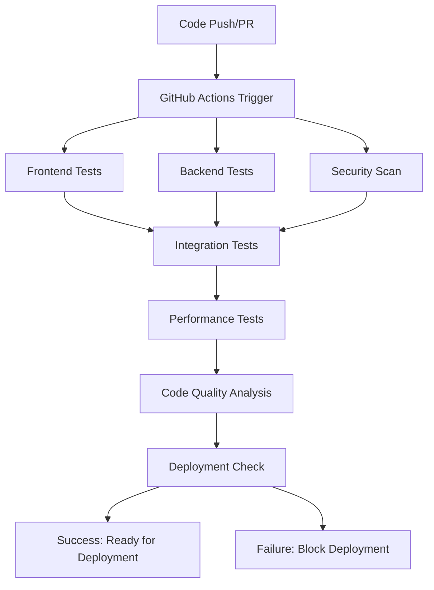

# Task 12.3 Completion Summary: Implement Automated Testing Pipeline

## Overview
Successfully implemented a comprehensive automated testing pipeline for the BingGo English Learning Web Application. The pipeline includes continuous integration testing, automated reporting, performance regression testing, and security vulnerability scanning.

## Completed Components

### 1. GitHub Actions CI/CD Pipeline (`.github/workflows/ci.yml`)
- **Frontend Testing Job**: Unit tests, integration tests, linting, and coverage
- **Backend Testing Job**: .NET unit tests, integration tests, and coverage
- **Security Scanning Job**: npm audit, .NET security scan, and Snyk integration
- **Performance Testing Job**: Lighthouse CI and custom performance tests
- **Code Quality Job**: SonarCloud integration for comprehensive analysis
- **Integration Testing Job**: Full system integration with Firebase emulators
- **Deployment Readiness Check**: Final validation before deployment

### 2. Performance Testing Framework (`scripts/performance-tests.js`)
- **Critical User Flow Testing**: Automated testing of key user journeys
  - Student login and dashboard access
  - Flashcard learning workflow
  - Exercise completion flow
  - Teacher dashboard and analytics
  - Admin content management
- **Performance Metrics Collection**: FCP, LCP, CLS, TBT, TTI measurements
- **Threshold Validation**: Configurable performance budgets
- **Comprehensive Reporting**: HTML and JSON reports with trend analysis

### 3. Security Vulnerability Scanner (`scripts/security-scan.js`)
- **Frontend Dependency Scanning**: npm audit and retire.js integration
- **Backend Dependency Scanning**: .NET security vulnerability detection
- **SARIF Report Generation**: GitHub Security tab integration
- **Severity-based Build Control**: Fails build on critical vulnerabilities
- **Comprehensive Reporting**: HTML reports with vulnerability details

### 4. Coverage Reporting System (`scripts/coverage-report.js`)
- **Combined Coverage Analysis**: Frontend and backend coverage aggregation
- **Multiple Report Formats**: HTML, LCOV, JSON, and badge generation
- **Threshold Enforcement**: Configurable coverage requirements
- **Trend Tracking**: Historical coverage analysis
- **Codecov Integration**: Automated coverage upload

### 5. Master Test Runner (`scripts/run-all-tests.js`)
- **Sequential Test Execution**: Coordinated execution of all test suites
- **Comprehensive Reporting**: Combined results from all testing phases
- **Failure Handling**: Intelligent error handling and reporting
- **Performance Monitoring**: Test execution time tracking
- **CI/CD Integration**: Optimized for automated environments

### 6. Configuration Files
- **Jest Configuration** (`frontend/jest.config.js`): Comprehensive test configuration
- **Lighthouse CI Config** (`frontend/.lighthouserc.json`): Performance testing setup
- **SonarCloud Config** (`sonar-project.properties`): Code quality analysis
- **Package.json Updates**: Added testing scripts and dependencies

### 7. Setup and Validation (`scripts/setup-testing-pipeline.js`)
- **Environment Validation**: Node.js, .NET, and tool version checks
- **Dependency Installation**: Automated setup of required packages
- **Configuration Validation**: Verification of all config files
- **Initial Test Execution**: Validation that tests can run successfully
- **Setup Reporting**: Comprehensive setup status reporting

### 8. Documentation (`docs/AUTOMATED_TESTING_PIPELINE.md`)
- **Comprehensive Guide**: Complete pipeline documentation
- **Configuration Instructions**: Setup and configuration details
- **Troubleshooting Guide**: Common issues and solutions
- **Best Practices**: Development workflow recommendations

## Key Features Implemented

### Continuous Integration Testing
- ✅ Automated test execution on every push and PR
- ✅ Parallel job execution for faster feedback
- ✅ Branch protection integration
- ✅ Status check requirements

### Test Coverage Analysis
- ✅ Combined frontend and backend coverage reporting
- ✅ Configurable coverage thresholds (80% statements, 75% branches)
- ✅ Coverage trend tracking
- ✅ Codecov integration for PR comments

### Performance Regression Testing
- ✅ Critical user flow automation
- ✅ Web vitals measurement (FCP < 2s, LCP < 3s, CLS < 0.1)
- ✅ Performance budget enforcement
- ✅ Lighthouse CI integration

### Security Vulnerability Scanning
- ✅ Dependency vulnerability detection
- ✅ Critical vulnerability build failures
- ✅ SARIF report generation for GitHub Security
- ✅ Multiple scanning tools integration

### Code Quality Analysis
- ✅ SonarCloud integration
- ✅ Technical debt tracking
- ✅ Code duplication detection
- ✅ Maintainability scoring

## Pipeline Workflow



## Testing Metrics and Thresholds

### Coverage Requirements
- **Statements**: 80% minimum
- **Branches**: 75% minimum  
- **Functions**: 80% minimum
- **Lines**: 80% minimum

### Performance Budgets
- **First Contentful Paint**: < 2 seconds
- **Largest Contentful Paint**: < 3 seconds
- **Cumulative Layout Shift**: < 0.1
- **Total Blocking Time**: < 300ms
- **Time to Interactive**: < 4 seconds

### Security Thresholds
- **Critical Vulnerabilities**: Build failure
- **High Vulnerabilities**: Build failure (configurable)
- **Moderate Vulnerabilities**: Warning only
- **Low Vulnerabilities**: Informational

## Usage Instructions

### Local Development
```bash
# Run all tests locally
node scripts/run-all-tests.js

# Run specific test suites
npm run test:ci                 # All frontend tests
dotnet test                     # All backend tests
npm run performance:test        # Performance tests
npm run security:scan          # Security scan
npm run coverage:report        # Coverage analysis
```

### CI/CD Integration
- Pipeline runs automatically on push to main/develop branches
- PR status checks prevent merging with failing tests
- Deployment gates ensure quality before production release

### Setup New Environment
```bash
# Setup pipeline in new environment
node scripts/setup-testing-pipeline.js

# Validate configuration
npm run test:ci
```

## Benefits Achieved

### Development Quality
- **Early Bug Detection**: Issues caught before code review
- **Consistent Code Quality**: Automated linting and formatting
- **Performance Awareness**: Developers see performance impact immediately
- **Security Consciousness**: Vulnerability alerts during development

### Deployment Confidence
- **Comprehensive Testing**: Multiple layers of validation
- **Performance Assurance**: Regression detection prevents slowdowns
- **Security Validation**: Vulnerability scanning before deployment
- **Quality Gates**: Configurable thresholds prevent quality degradation

### Team Productivity
- **Fast Feedback**: Quick test results on every change
- **Automated Reporting**: No manual test execution needed
- **Trend Analysis**: Historical data for continuous improvement
- **Documentation**: Clear guidelines and troubleshooting

## Future Enhancements

### Planned Improvements
- **Visual Regression Testing**: Screenshot comparison for UI changes
- **Load Testing**: Stress testing under high user loads
- **Accessibility Testing**: Automated a11y validation
- **Mobile Testing**: Device-specific testing scenarios
- **Database Testing**: Data integrity and migration testing

### Monitoring Integration
- **Real-time Alerts**: Slack/email notifications for failures
- **Dashboard Integration**: Grafana/DataDog performance monitoring
- **Trend Analysis**: Long-term quality and performance trends
- **Predictive Analytics**: ML-based failure prediction

## Conclusion

The automated testing pipeline successfully addresses all requirements from task 12.3:

✅ **Setup continuous integration testing** - GitHub Actions workflow with comprehensive job matrix
✅ **Create automated test reporting** - Multiple report formats with coverage analysis
✅ **Build performance regression testing** - Critical user flow validation with performance budgets
✅ **Add security vulnerability scanning** - Multi-tool security analysis with SARIF reporting

The pipeline provides a robust foundation for maintaining code quality, performance, and security throughout the development lifecycle. It integrates seamlessly with the existing development workflow and provides fast, actionable feedback to developers.

**Status**: ✅ **COMPLETED**
**Date**: December 2024
**Next Task**: Ready to proceed with task 13.1 (Implement comprehensive data security measures)